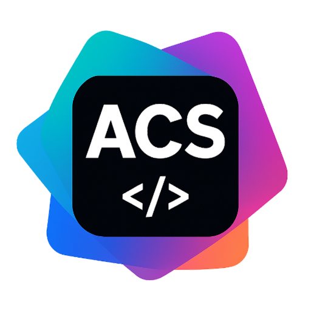

<div align="center">

  

  # Ryzix Code

  **An agentic Android code editor — Cursor AI, running natively on your device.**

  [](https://github.com/RD7890/ryzix-code/actions)
  [](LICENSE)
  [](https://developer.android.com)
  [](https://aistudio.google.com)
  []()

  </div>

  ---

  ## What is Ryzix Code?

  Ryzix Code is a **native Android code editor with an autonomous AI agent built in** — think Cursor or Windsurf, but running entirely on your phone or tablet.

  You describe a task. The agent reads your code, edits files, runs Gradle, diffs the result, and loops until it's done — without you lifting a finger.

  It's based on [AndroidIDE](https://github.com/AndroidIDEOfficial/AndroidIDE), stripped of its heavy Java/Kotlin/XML language-server infrastructure and rebuilt around a **multi-provider AI agent** that supports Gemini, OpenAI, Claude, Grok, DeepSeek, and local LLMs.

  ---

  ## How the Agent Works

  The agent runs a **ReAct loop** (Reason → Act → Observe) using your chosen LLM:

  ```
  You: "Add a dark-mode toggle to MainActivity"

  Agent:
    → list_dir(".")               discovers project layout
    → file_read("MainActivity.kt")  reads the file
    → grep("setTheme|DayNight")   finds existing theme usage
    → file_edit(...)              surgically inserts the toggle
    → terminal("./gradlew assembleDebug")  verifies the build
    → "Done — dark mode added and build passes ✓"
  ```

  The agent has **permission gates** — it asks before modifying files outside the project, running destructive commands, or accessing the internet.

  ---

  ## Agent Tools

  | Tool | Description |
  |------|-------------|
  | `file_read` | Read any file, with optional line range |
  | `file_write` | Create or overwrite a file |
  | `file_edit` | Surgical find-and-replace inside a file |
  | `terminal` | Run any shell command (Gradle, Git, shell scripts) |
  | `grep` | Regex search across the entire codebase |
  | `list_dir` | List files and directories |
  | `project_tree` | Get a compact tree of the full project |

  ---

  ## Supported AI Providers

  | Provider | Models |
  |----------|--------|
  | Google Gemini | Gemini 2.0 Flash, Gemini 1.5 Pro |
  | OpenAI | GPT-4o, GPT-4 Turbo |
  | Anthropic | Claude 3.5 Sonnet, Claude 3 Opus |
  | xAI | Grok-2 |
  | DeepSeek | DeepSeek-Coder V2 |
  | Local LLM | Ollama-compatible endpoints |

  ---

  ## What Was Stripped vs What Was Kept

  | Removed | Kept |
  |---------|------|
  | Java Language Server | ✅ Code editor (sora-editor) |
  | Kotlin Language Server | ✅ Terminal emulator (Termux) |
  | XML Language Server | ✅ File manager + Git integration |
  | Visual Layout Designer | ✅ Gradle build support |
  | SDK / NDK Manager | ✅ Event bus + logging |
  | Heavy indexing engine | ✅ **AI Agent (new)** |
  | AAPT2 compilation pipeline | ✅ XML resource parsing (basic) |

  ---

  ## Stack

  | Layer | Technology |
  |-------|-----------|
  | Language | Kotlin |
  | Editor core | [sora-editor](https://github.com/Rosemoe/sora-editor) |
  | Terminal | Termux emulator |
  | AI | Gemini / GPT / Claude / Grok / DeepSeek / local LLM |
  | Build | Gradle KTS + Android AGP 8.x |
  | Min SDK | Android 8.0 (API 26) |

  ---

  ## Project Layout

  ```
  ryzix-code/
  ├── ai/agent/           # Autonomous AI agent (LLM loop, tools, permissions)
  ├── core/app/           # Main application module
  ├── core/projects/      # Project & module model
  ├── editor/             # Code editor (sora-editor integration)
  ├── termux/             # Terminal emulator
  ├── xml/                # XML parsing utilities
  ├── tooling/            # Gradle tooling API
  ├── event/              # Event bus
  ├── logging/            # Logging infrastructure
  └── utilities/          # Shared utilities, preferences, templates
  ```

  ---

  ## Getting Started

  ### Prerequisites

  - Android 8.0+ device (API 26+)
  - An API key for your chosen AI provider  
    → Free Gemini key at [aistudio.google.com](https://aistudio.google.com)

  ### Build from Source

  ```bash
  git clone https://github.com/RD7890/ryzix-code.git
  cd ryzix-code
  ./gradlew :core:app:assembleRelease
  ```

  ### Configure

  1. Install the APK on your device
  2. Open **Settings → AI Provider**
  3. Paste your API key and select your preferred model
  4. Open a project and start a conversation with the agent

  ---

  ## Roadmap

  - [ ] Diff preview — show agent edits before applying
  - [ ] Multi-file context — feed all open files to the agent automatically  
  - [ ] Voice input — dictate tasks hands-free
  - [ ] Plugin system — write custom agent tools in Kotlin
  - [ ] Code review mode — agent reviews PRs and suggests fixes
  - [ ] Offline mode — llama.cpp for fully private, on-device inference

  ---

  ## Contributing

  Pull requests are welcome. For major changes please open an issue first.

  1. Fork the repo
  2. Create a feature branch: `git checkout -b feature/my-feature`
  3. Commit your changes: `git commit -m 'feat: add my feature'`
  4. Push and open a PR

  ---

  ## License

  **GPL v3** — see [LICENSE](./LICENSE)

  Based on [AndroidIDE](https://github.com/AndroidIDEOfficial/AndroidIDE) and [Android Code Studio](https://github.com/RD7890/android-code-studio) by RD7890.
  